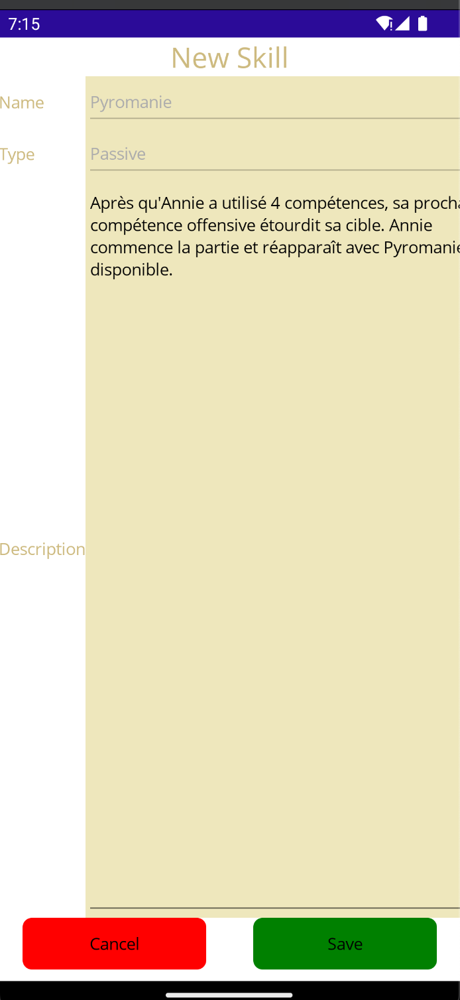

<h1 align="center">🏆 MVVM LeagueOfLegends 📝</h1>

The goal of MVVM_LOL is to propose a multiplateform application allowing the user to see information on the characters of the famous game League Of Legends and edit their information.

## ✔️ Features

- [x] Browse characters with a pagination system.
- [x] See the detail of each character: name, icon, image, bio, characteristics, class, skills...
- [x] Edit your champions: change their name, images, icons, bio, characteristics, class, skills,...
- [x] Add your own champions and delete the ones you don't like.
- [x] Many buttons creates a easy editing / adding / deleting system.

## 📱 Application

Here you can see the actual visual of the application 

    
    
    

    
    
    
    

    
    
    
    

    <i>
        As you can see, the visuals are really consistent with those of the actual applications, both in blur effects, in shapes, colors and layout.
    </i>

## Peculiarities

### Master view
From this view you can see the list of the champions. They are displayed 5 y 5, you can change the current page by clicking on the buttons at the bottom, this is working. For some reasons, the image of the vchampions are sometimes not correctly bound on Android and there is other images displayed and I don't know why... Also a BIG bug is present on this page. If you change the current page, sometimes, the screen became blank and you can do nothing. Even the home page that simply has labels is not rendered. The solution to avoid this bug is to change the phone orientation. I know this is weird and I don't understand why this happen.

From here you can select each champion, click on the add button and a popup is displayed and you can enter the name of your champion. You can then edit it. you can also swipe the elements to edit them or to delete them.

### Detail page

You can see thechampion details on this page. I don't really know what to say about that, the UI can be improved for sure, but the content is here and everythng works fine... From here you can choose to delete the item from the toolbar or to edit it. You will be redirect to the champions page / to the edit page.

### Add / Edit champion page

The same view is used to add a champion or to edit it. You can edit everything except the characteristics (because I have use my ReadOlyDictionary instead of an observable collection of custom KVP that will allow edition). But you can always delete some characteristics if you don't want this value and add it again, it works. The name is not editable to preserve the unicity of the model. The class, icon, image can be changed. You can edit the description of the skills here, delete them as well as add new skills. This will makes a popup appears to choose a name for your skill. You are then redirect to the skill edit page. Note that if you type a skill already existing, yu will be redirected to the edit page of this skill. Actually, it is not possible to change the skilltype of the skill to preserve the unicity of the model. A solution to that could be to edit the skill type at the same time as the name when we create a new skill, ut I don't have enought time to make a bigger popup. You can save your changes or not, you will be redirect to the master page (it will be better to redirect the user back to the detail page).

This page uses an EditableChampion to better separates the Champion view model and to have a better organization between the classes.

### Add / Edit skill page

Here you can edit the description of your skill and save it or not.

### Big bugs present in the application
- [x] Sometimes the screen became black or some components aren't rendered, simply rotate the screen to force the engine to redraw it. You may think it is impossible to delete the champions from the master page but it is ismply a visual bug.
- [x] The app crashes on iOS, and I don't know why.
- [x] Soetimes, the app freezes during 3-5 seconds, this is very unfortunate.

(The UI can be improve as weel as the user experience).

The application works with my custom MVVM, which is very simple and consists of a base class containing methods to notify and update command, and a generic class that encapsulates a model, but I haven't the time to use the MAUI toolkit.

## MVVM Toolkit of the project

### Description

This League Of Legends project demonstrates the usage of the Model-View-ViewModel (MVVM) architectural pattern. It provides an example of implementing MVVM using two different approaches.

### By-Hand Version

The only version of the app was built "by hand" and involved meticulous control over every property and command. This approach resulted in a significant amount of repeated code. You can test this version by checking out the main branch of this project (`master`).

### MVVM Community Toolkit Version

To improve the codebase and reduce boilerplate, the app can be refactored using .NET's MVVM Community Toolkit. This will reduce the unnecessary code and utilizing annotations and partial classes for more streamlined development. I have not develop this version because the timing was too short.

## Architecture of the project

This project uses the MVVM architectural pattern. First we have the model. It contains the data, and the ogic of the application.

Then, the view is reponsible of displaying the elements to the final users.

In the middle we have the view model. But in fact, there is two differents View Models in this application.

### App-Dependent View Model

The app-dependent view model is responsible for managing navigation through commands. It handles the logic and behavior related to navigating between different views or screens within the application.

### Model-Dependent View Model

The model-dependent view model is responsible for providing properties that can be bound to the user interface elements. It also sends notifications when these properties change, allowing for real-time updates in the view. Additionally, it acts as a wrapper around the underlying model, encapsulating its functionality and exposing it to the view.

By employing both types of view models, the MVVM Toolkit demonstrates a comprehensive implementation of the MVVM pattern, enabling efficient navigation and seamless data binding within the application.

There is three differents projets. The model, the view, and the view model. But the view model project only contains the wrappers for the model. The applicative view model is contains in the View project because it is dependant of the view, too dependant to be put with the wrapper view models. The view uses the application view model and also the wrappers. With this architecture, we separates the navigation and the wrapping mecanism. 

### Final class diagram

The final class diagram of this application looks like something like that (I don't have put all the methods and the wrapped properties purposely because the diagram would be too big):

We can easily see the links from the view, from its view model, to the other view models that encapsulates the data of each Model class.

## 🖥️ Langages and technologies used

- .NET MAUI ([API reference](https://learn.microsoft.com/en-us/dotnet/maui/))

## 🧵 Prerequisities

- [Visual Studio](https://visualstudio.microsoft.com/)

## ⚙️ How to run the app ?

1. Start Visual Studio.
2. Open the solution file under `Sources` named `LeagueOfLegends.sln`.
3. Start an emulator and run the app.

## 📌 Documentation

The [Wiki](https://codefirst.iut.uca.fr/git/jeremy.tremblay/MVVM_LOL/wiki) is actually empty. The documantion will be added soon!

Also, look at the `Documentation` folder at the root of this repository!

## 👤 Author

**TREMBLAY Jérémy**

* Github: [@JeremyTremblay2](https://github.com/JeremyTremblay2)
* LinkedIn: [@Jérémy Tremlay](https://fr.linkedin.com/in/j%C3%A9r%C3%A9my-tremblay2)

## 📝 License

I want to leave the possibility to other people to work on this project, to improve it and to make it grow, that's why we decided to place it under MIT license.

> Read more about the [MIT licence](https://opensource.org/licenses/MIT).